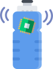

<p align="center">
  
</p>
<h1 align="center">
  Hydration Bottle
</h1>
<p align="center">
  <i>Drink enough water!</i>
</p>

## Build Setup

```bash
# install dependencies
yarn

# copy environment file and fill in
cp .env.example .env

# serve with hot reload at localhost:3000
yarn start:dev

# build for production and launch server
yarn build
yarn start
```

## License

Hydration Bottle is an online platform for connecting and reading your smart water bottle. See [the pycom repository for more code](https://github.com/jappe999/hydration-bottle-pycom).

The source of this platform is licensed under the [GNU GENERAL PUBLIC LICENSE](https://github.com/jappe999/hydration-bottle/blob/develop/LICENSE). Bug reports and contributions are welcome.
